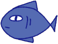

# SHARK INVASION!

---
Play as a small, vulnerable fish and survive the shark invasion! 

## About

---
In *Shark Invasion*, the player plays as a small fish amidst the deep blue ocean. 
The goal is simple: survive and grow! To do so, avoid the sharks and consume the 
shrimp before the timer runs out! Organic matter will descend as marine snow, eat 
them to avoid becoming too noticeable for the shark! Beware, more aggressive sharks 
will spawn as the game progresses. 

## Preview

---
[Shark Invasion: Gameplay](https://youtu.be/yGb4_2TFO1o)

## Instructions

---
| Game Element                              | Description                                                                                                            |
|:------------------------------------------|:-----------------------------------------------------------------------------------------------------------------------|
|    | The player plays as a blue fish.   Use the arrow keys to move the fish right, left, up, and down.                  |
|  | The shrimp looks a bit grumpy, but they are tasty.   To grow bigger and obtain points, eat the shrimp!             |
|   | Those teeth are no joke. Avoid the sharks!   Thankfully, you have three hearts, use them sparely.                  |
|   | Not all fish have three hearts!   Gained 15 extra points per leftover heart! |
|   | Collect these time power-ups to increase your timer by   15 more seconds!                                          |
|    | The larger you grow, the more vulnerable you are!   Collect the descending marine snow to shrink in size!          |

## Authors

---
| Name                  | UD Email               |
|:----------------------|:-----------------------|
| Winnie Li             | winnie@udel.edu        |
| Samita Bomasamudram   | samiboma@udel.edu      |

## Acknowledgements

---
- [Designer Guide](https://designer-edu.github.io/designer/contents.html#)
- [GitHub Docs](https://docs.github.com/en/get-started/writing-on-github/getting-started-with-writing-and-formatting-on-github/basic-writing-and-formatting-syntax)
- [Stack Overflow](https://stackoverflow.com/a/33566654)

## Game Plan

---
### Phase 1
- [X] Fish Exists: *There is a fish on the screen.*
- [X] Fish Moves: *The fish moves left, right, up, and down when the arrow keys
are pressed.*
- [X] Screen Limits: *The fish cannot be moved offscreen, instead it wraps to the 
other side.*
- [X] Spawning Shrimp: *Shrimp randomly spawns within the given boundaries.*

[Video: Phase 1 Progress](https://youtu.be/xGT1E1P8qBs)

### Phase 2
- [X] Grow: *If fish collide with shrimp, the fish grows bigger.*
- [X] Spawning Sharks: *Sharks randomly spawn within the given boundaries.*
- [X] Shark Move: *Sharks move from side to side.*
- [X] Fish Hurt: *If fish collide with a shark, the player loses a life.* 
- [X] Fish Last Life: *If player has one life left, fish starts flickering.*

[Video: Phase 2 Progress](https://youtu.be/jQUauZPf3S8)

### Phase 3
- [X] Display Stats: *A section of the screen that displays the timer, current 
score, and number of lives.*
- [X] Game Over: *Displays the player's final score when the player runs 
out of lives/timer runs out.*
- [X] Bonus Points: *If player has remaining lives left after the timer runs out, each lives count as 
an extra 15 points.*
- [X] Play Button: *A cover screen with a play button.*
- [X] More Sharks: *As the game progresses, more shark is spawned. The difficulty grows 
as the shark also grows in speed.*
- [X] Marine Snow: *Marine snow will descend from above, and if collides with fish, the
fish shrinks.*
- [X] Add Time: *Time-power ups would descend from above, and if collides with fish,
15 more seconds is added to the timer.*